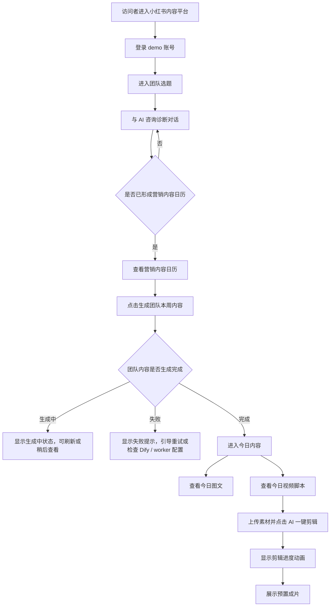
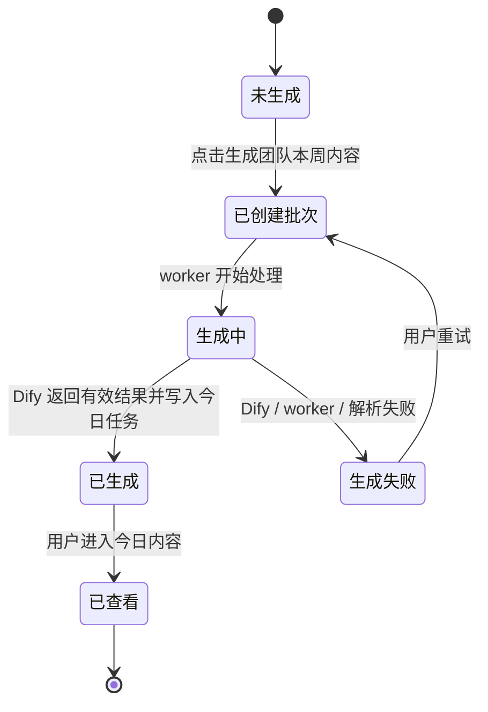
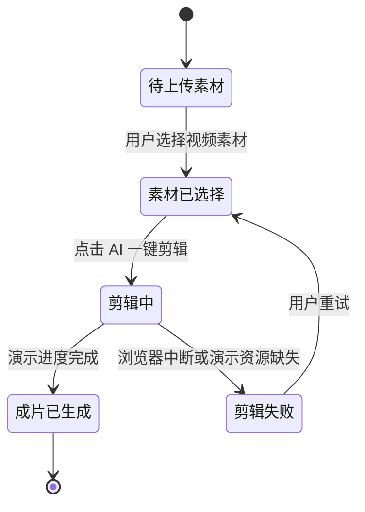

# 产品需求文档：小红书内容平台「今日内容」主链路收口 - V0.1 草案

状态：执行前草案  
日期：2026-06-05  
适用应用：`apps/content-growth-platform/`

## 1. 综述

### 1.1 项目背景与核心问题

当前小红书 / 内容获客平台已经形成了几条能力：

1. 用户可以从作品集进入真实运行的小红书内容平台。
2. 用户可以登录后进入 `AI 咨询诊断 / 团队选题`。
3. 咨询结果可以沉淀为营销内容日历。
4. 系统已经具备 Dify workflow 调用链路：应用侧配置 `DIFY_BASE_URL` 和 `DIFY_API_KEY`，由后端 / worker 调用 Dify 生成内容。
5. 成员端已有 `内容日历 / 今日图文 / 今日视频` 页面，能够承接“每天一条图文 + 一条视频脚本”的团队内容链路。

当前核心问题不是能力缺失，而是演示主链路分叉：

- 侧边栏仍暴露 `生成图文`、`生成视频` 两个旧工作台入口。
- 旧图文工作台和旧视频工作台的心智更像“从工作台重新生成内容”，与现在“团队选题 -> 营销日历 -> Dify 生成团队内容 -> 今日内容承接”的主链路冲突。
- 侧边栏里的 `成员端预览` 命名偏内部调试，不适合作为面试官体验入口。
- 用户期望演示时不解释两套工作台，不让面试官误入旧链路，而是直接体验一个连贯的产品故事。

本 PRD 的核心决策：

> 不大改旧图文工作台和旧视频工作台。将面试演示主入口收口到“今日内容”，复用现有成员端内容日历链路；旧工作台从主导航隐藏，保留路由和代码作为后续二级能力或兼容入口。

### 1.2 目标

1. 将 `成员端预览` 产品化为 `今日内容`。
2. 让登录后的主演示路径变成：
   `团队选题 -> 营销内容日历 -> 生成团队本周内容 -> 今日内容 -> 今日图文 / 今日视频脚本`
3. 隐藏旧 `生成图文`、`生成视频` 主导航入口，降低链路歧义。
4. 保留现有旧工作台代码，不在本阶段重写图文工作台和视频工作台。
5. 在 `今日内容` 中承接 Dify 生成结果，让图文和视频脚本以“已准备好的团队内容”形式展示。
6. 为视频脚本增加演示级 `AI 一键剪辑` 闭环：上传素材、进度动画、最终预置成片展示。该能力用于面试演示，不等同于真实 video-worker 全链路。

### 1.3 非目标

本阶段不做：

1. 不重写 `article-workbench.tsx`。
2. 不重写 `video-workbench.tsx`。
3. 不把 Dify workflow 逻辑搬进前端页面。
4. 不新增或修改 Dify workflow 本身。
5. 不强行跑通真实 video-worker / FireRed / OpenStoryline 成片链路。
6. 不把演示视频剪辑伪装成生产级真实剪辑能力。
7. 不处理 OSS / COS 存储完整配置。
8. 不改变数据库主结构，除非实现中发现状态展示必须补极小字段；原则上优先使用现有 `daily_content_tasks`、`generatedArticle`、`generatedVideoScript`、`generationStatus`。

### 1.4 核心业务流程 / 用户旅程地图

1. **阶段一：进入内容平台**  
   访问者从作品集进入小红书内容平台，使用 demo 账号登录。

2. **阶段二：AI 团队选题**  
   用户在 `团队选题` 页面与 AI 咨询诊断对话，形成策略资产和营销内容日历。

3. **阶段三：生成团队内容**  
   用户点击 `生成团队本周内容`，系统创建 Dify 生成批次，并由内容生成链路产出每天的图文和视频脚本。

4. **阶段四：查看今日内容**  
   用户进入 `今日内容`，看到今天的图文内容包和视频脚本内容包。

5. **阶段五：演示视频剪辑**  
   用户进入今日视频，上传素材，点击 `AI 一键剪辑`，系统展示剪辑进度动画并最终展示一条预置成片。

### 1.5 Mermaid 图

#### 1.5.1 用户操作流



#### 1.5.2 团队内容生成状态机



#### 1.5.3 视频演示剪辑状态机



## 2. 用户故事详述

### 阶段一：入口收口

---

#### US-01：作为面试演示访问者，我希望侧边栏只暴露清晰主链路，以便理解产品不是两套生成系统

**价值陈述**

- **作为** 面试官或外部体验者
- **我希望** 登录后看到清晰的主导航，不被旧图文 / 视频工作台入口干扰
- **以便于** 按照“团队选题 -> 今日内容”的逻辑理解产品

**业务规则与逻辑**

1. 前置条件：
   - 用户已登录内容平台。
   - 用户进入 owner dashboard。

2. 主导航调整：
   - 保留 `团队选题`。
   - 将 `成员端预览` 改名为 `今日内容`。
   - `今日内容` 入口优先跳转到 `/member/calendar`，而不是 `/member` 项目介绍页。
   - 从主导航隐藏 `生成图文`。
   - 从主导航隐藏 `生成视频`。
   - 保留 `社媒爆款内容库`、`我的内容`、`团队成员`、`用户信息`，但演示时主路径不依赖这些页面。

3. 旧路由处理：
   - `/dashboard/article` 和 `/dashboard/video` 路由暂不删除。
   - 直接访问旧路由时可继续工作，避免破坏历史链接。
   - 本阶段不承诺旧路由视觉或逻辑完全符合新主链路。

4. 登录页文案调整：
   - 不再写“进入咨询诊断、图文工作台和视频工作台”。
   - 改为“进入团队选题、营销日历和今日内容”。

**验收标准**

- 场景 1：主导航隐藏旧工作台入口  
  **GIVEN** 用户已登录 owner dashboard  
  **WHEN** 用户查看左侧导航  
  **THEN** 看不到 `生成图文` 和 `生成视频` 两个主导航项  
  **AND** 可以看到 `团队选题` 和 `今日内容`

- 场景 2：今日内容入口直达内容日历  
  **GIVEN** 用户已登录 owner dashboard  
  **WHEN** 点击 `今日内容`  
  **THEN** 页面进入 `/member/calendar` 或等效的今日内容日历页  
  **AND** 页面展示今日图文和今日视频两个任务卡

- 场景 3：旧路由兼容  
  **GIVEN** 用户手动访问 `/dashboard/article` 或 `/dashboard/video`  
  **WHEN** 页面加载  
  **THEN** 不应因为导航隐藏而 404  
  **AND** 本阶段不要求它们出现在主演示路径中

**页面布局线框图**

```text
+--------------------------------------------------------------+
| 内容日历工作台                                                |
+----------------------+---------------------------------------+
| AI  团队选题          |                                       |
|     今日内容   <--    |           当前页面内容                 |
|     社媒爆款内容库    |                                       |
|     我的内容          |                                       |
|     团队成员          |                                       |
|     用户信息          |                                       |
|                      |                                       |
|  用户账号 / 退出      |                                       |
+----------------------+---------------------------------------+

隐藏：
- 生成图文
- 生成视频
```

---

### 阶段二：团队选题到今日内容

---

#### US-02：作为用户，我希望在团队选题中生成团队本周内容后，能进入今日内容查看结果

**价值陈述**

- **作为** 内容平台 demo 用户
- **我希望** 从营销内容日历生成团队内容后，直接进入今日内容查看图文和视频脚本
- **以便于** 体验一条从 AI 对话到可发布内容的完整链路

**业务规则与逻辑**

1. 前置条件：
   - 用户位于 `团队选题` 页面。
   - 当前咨询会话已有营销内容日历。
   - 系统可以创建内容生成批次。

2. 操作流程：
   - 用户点击 `查看全部内容` 或打开营销内容日历弹窗。
   - 用户点击 `生成团队本周内容`。
   - 系统创建 Dify 内容生成批次。
   - 页面显示批次状态：待处理、生成中、成功、失败。
   - 成功后用户进入 `今日内容` 查看今天的图文和视频脚本。

3. Dify 调用边界：
   - 前端不直接调用 Dify。
   - 应用只配置 `DIFY_BASE_URL` 和 `DIFY_API_KEY`。
   - 实际内容生成由后端 / worker 处理。
   - 若 worker 未运行，页面必须显示“生成中 / 待处理”，不能假装生成完成。

4. 错误处理：
   - 没有营销内容日历时，`生成团队本周内容` 按钮不可用或提示先完成团队选题。
   - Dify key 缺失时，提示生成服务未配置。
   - worker 未处理时，提示内容正在生成，可刷新。
   - Dify 返回失败或解析失败时，展示失败状态并允许重试。

**验收标准**

- 场景 1：成功创建内容生成批次  
  **GIVEN** 当前会话已有营销内容日历  
  **WHEN** 用户点击 `生成团队本周内容`  
  **THEN** 页面显示已创建生成任务  
  **AND** 展示本批次任务数量和生成状态

- 场景 2：生成完成后可进入今日内容  
  **GIVEN** 今日任务的图文和视频脚本已生成成功  
  **WHEN** 用户点击 `今日内容`  
  **THEN** 页面展示今日图文卡和今日视频卡  
  **AND** 两个卡片均显示已生成内容，而不是要求用户重新从零生成

- 场景 3：worker 未处理  
  **GIVEN** 已创建生成批次但 worker 未完成处理  
  **WHEN** 用户进入今日内容  
  **THEN** 任务卡展示生成中 / 待处理状态  
  **AND** 不展示虚假的已生成内容

**页面布局线框图**

```text
团队选题页
+--------------------------------------------------------------+
| AI 咨询诊断                                                   |
+--------------------------------------+-----------------------+
| 对话区                                | 我的策略资产          |
|                                      |                       |
| 用户与 AI 对话                        | 营销内容日历           |
| AI 生成策略和内容方向                 | [查看全部内容]          |
|                                      | [生成团队本周内容]      |
+--------------------------------------+-----------------------+

营销内容日历弹窗
+--------------------------------------------------------------+
| 营销内容日历                         [生成团队本周内容] [X]   |
+--------------------------------------------------------------+
| Day 1  图文  标题 / 摘要                                      |
| Day 1  视频  标题 / 摘要                                      |
| Day 2  图文  标题 / 摘要                                      |
| ...                                                          |
+--------------------------------------------------------------+
| 生成状态：进行中 / 已完成 / 失败，可刷新                       |
+--------------------------------------------------------------+
```

---

### 阶段三：今日内容页承接团队端链路

---

#### US-03：作为用户，我希望今日内容页直接展示当天图文和视频脚本，以便不再进入旧工作台重新生成

**价值陈述**

- **作为** 内容平台 demo 用户
- **我希望** 今日内容页展示已经由团队日历 / Dify 生成好的图文和视频脚本
- **以便于** 直接看到“AI 已经把今天要发什么准备好”

**业务规则与逻辑**

1. 前置条件：
   - 用户已登录。
   - 用户可访问成员端内容日历。
   - 今日任务存在。

2. 页面命名：
   - 页面入口名称：`今日内容`。
   - 页面内主标题可以使用 `今日内容` 或 `今日内容日历`。
   - 不再使用 `成员端预览` 作为用户可见主入口文案。

3. 今日内容页展示：
   - 顶部展示日期、今日主题和刷新按钮。
   - 展示 `今日图文` 卡片：
     - 标题
     - 摘要
     - 生成状态
     - 操作按钮：`查看图文`
   - 展示 `今日视频` 卡片：
     - 标题
     - 摘要
     - 生成状态
     - 操作按钮：`查看脚本`
   - 展示未来 7 天任务概览。

4. 生成状态规则：
   - `not_started`：显示未生成，引导回到团队选题生成团队内容。
   - `pending` / `running`：显示生成中，可刷新。
   - `succeeded`：允许查看图文 / 脚本。
   - `failed`：显示生成失败，可回团队选题重试。

5. 对旧工作台的关系：
   - 今日图文不跳 `/dashboard/article`。
   - 今日视频不跳 `/dashboard/video`。
   - 今日内容使用现有 `/member/article/:taskId` 和 `/member/video/:taskId` 或等效页面。

**验收标准**

- 场景 1：进入今日内容  
  **GIVEN** 用户点击侧边栏 `今日内容`  
  **WHEN** 页面加载成功  
  **THEN** 展示今日主题、今日图文卡、今日视频卡、未来 7 天列表

- 场景 2：图文已生成  
  **GIVEN** 今日图文状态为 `succeeded`  
  **WHEN** 用户点击 `查看图文`  
  **THEN** 进入图文内容包页面  
  **AND** 展示标题、正文、标签、CTA、图片建议

- 场景 3：视频脚本已生成  
  **GIVEN** 今日视频状态为 `succeeded`  
  **WHEN** 用户点击 `查看脚本`  
  **THEN** 进入视频脚本页面  
  **AND** 展示标题、hook、分镜、素材清单

- 场景 4：内容未生成  
  **GIVEN** 今日任务状态为 `pending` 或 `running`  
  **WHEN** 用户进入今日内容  
  **THEN** 卡片显示生成中  
  **AND** 用户不会被引导到旧工作台重新生成

**页面布局线框图**

```text
今日内容
+--------------------------------------------------------------+
| 2026-06-05                         [刷新]                   |
| 今日主题：本周主推方向 / 今日内容主题                         |
| 团队已经把今天的图文和视频脚本准备好。                         |
+--------------------------------------------------------------+

+-----------------------------+  +-----------------------------+
| 今日图文                    |  | 今日视频                    |
| 状态：已生成 / 生成中        |  | 状态：已生成 / 生成中        |
| 标题                         |  | 标题                         |
| 摘要                         |  | 摘要                         |
| [查看图文]                   |  | [查看脚本]                   |
+-----------------------------+  +-----------------------------+

+--------------------------------------------------------------+
| 未来 7 天                                                     |
| 06-06  主题 / 图文标题 / 状态                                 |
| 06-07  主题 / 图文标题 / 状态                                 |
| ...                                                          |
+--------------------------------------------------------------+
```

---

### 阶段四：今日图文内容包

---

#### US-04：作为用户，我希望今日图文页展示已生成文案，以便复制发布而不是重新生成

**价值陈述**

- **作为** 内容平台 demo 用户
- **我希望** 今日图文页面直接展示 Dify 生成的图文内容包
- **以便于** 快速理解系统已经产出可发布内容

**业务规则与逻辑**

1. 前置条件：
   - 用户从今日内容进入今日图文。
   - 当前任务存在。

2. 内容来源：
   - 优先展示 `articleTask.generatedArticle`。
   - 若生成内容不存在，展示当前已有 fallback，但必须明确是“内容包暂未生成 / 可稍后刷新”，不能让用户误以为 Dify 结果已经生成。

3. 展示内容：
   - 标题
   - 正文
   - 话题标签
   - CTA / 行动引导
   - 封面文案
   - 图片素材或图片 brief
   - 复制按钮

4. 操作：
   - `复制标题正文标签`
   - `复制行动引导`
   - 如有图片 URL，可打开图片。

5. 非目标：
   - 不在本页做“重新生成图文”主按钮。
   - 不跳转旧图文工作台作为默认操作。

**验收标准**

- 场景 1：展示已生成图文  
  **GIVEN** 今日图文已生成成功  
  **WHEN** 用户进入今日图文页  
  **THEN** 页面展示标题、正文、标签和 CTA  
  **AND** 用户可以复制发布文案

- 场景 2：无生成结果  
  **GIVEN** 今日图文未生成完成  
  **WHEN** 用户进入今日图文页  
  **THEN** 页面展示未生成 / 生成中提示  
  **AND** 不展示误导性的“已生成”文案

**页面布局线框图**

```text
今日图文
+--------------------------------------------------------------+
| < 返回今日内容                                                |
| 日期 · 图文任务                                               |
| 标题                                                         |
| 摘要                                                         |
+--------------------------------------------------------------+

+--------------------------------------------------------------+
| 已生成文案                                                   |
| 标题：...                                                    |
| 正文：...                                                    |
| 标签：#... #...                                              |
| [复制标题正文标签] [复制行动引导]                              |
+--------------------------------------------------------------+

+--------------------------------------------------------------+
| 已匹配图片 / 图片 brief                                       |
| [图片卡 1] [图片卡 2]                                         |
+--------------------------------------------------------------+
```

---

### 阶段五：今日视频脚本与演示剪辑

---

#### US-05：作为用户，我希望今日视频页展示已生成脚本并提供演示剪辑，以便体验从脚本到成片的闭环

**价值陈述**

- **作为** 内容平台 demo 用户
- **我希望** 今日视频页直接展示已生成的视频脚本，并能上传素材触发 AI 剪辑演示
- **以便于** 面试演示中看到“脚本 -> 素材 -> 剪辑 -> 成片”的完整体验

**业务规则与逻辑**

1. 前置条件：
   - 用户从今日内容进入今日视频。
   - 当前任务存在。

2. 内容来源：
   - 优先展示 `videoTask.generatedVideoScript`。
   - 若生成内容不存在，展示生成中 / 未生成状态。

3. 页面展示：
   - 标题
   - hook
   - 故事结构 / outline
   - 目标时长
   - 分镜列表：
     - 镜头顺序
     - 时长
     - 画面要求
     - 台词 / 字幕
     - 素材槽位
   - 素材清单
   - 上传素材区域
   - `AI 一键剪辑` 按钮

4. 演示剪辑：
   - 用户选择本地视频素材后，页面显示已选择文件。
   - 用户点击 `AI 一键剪辑`。
   - 页面显示进度模块：
     - 素材准备
     - 镜头匹配
     - 配音生成
     - 字幕与时间线
     - 合成渲染
     - 保存成片
   - 每个模块按顺序进入 running / succeeded。
   - 完成后展示预置 demo 视频。

5. 演示能力边界：
   - 本阶段的 `AI 一键剪辑` 是面试演示闭环。
   - 不要求真实调用 video-worker。
   - 不要求真实上传 OSS。
   - 实现中必须使用清晰的 demo flag 或本地状态命名，避免未来误判为生产真实剪辑。

6. 错误处理：
   - 未选择素材点击剪辑时，提示先上传素材。
   - demo 视频资源缺失时，显示可恢复错误：演示成片资源暂不可用。
   - 用户刷新页面后，已选择的本地文件不保证恢复；可要求重新选择。

**验收标准**

- 场景 1：展示已生成视频脚本  
  **GIVEN** 今日视频脚本已生成成功  
  **WHEN** 用户进入今日视频页  
  **THEN** 页面展示标题、hook、分镜脚本和素材清单

- 场景 2：上传素材后可触发演示剪辑  
  **GIVEN** 用户已进入今日视频页  
  **WHEN** 用户选择一个本地视频素材  
  **THEN** 页面显示文件已选择  
  **AND** `AI 一键剪辑` 可点击

- 场景 3：剪辑进度动画  
  **GIVEN** 用户已选择素材  
  **WHEN** 用户点击 `AI 一键剪辑`  
  **THEN** 页面按模块展示进度动画  
  **AND** 最终进入成片已生成状态

- 场景 4：展示预置成片  
  **GIVEN** 演示剪辑已完成  
  **WHEN** 页面进入完成态  
  **THEN** 展示可播放视频  
  **AND** 用户可以点击播放

- 场景 5：不选择素材  
  **GIVEN** 用户未选择素材  
  **WHEN** 点击 `AI 一键剪辑`  
  **THEN** 页面提示先上传素材  
  **AND** 不进入进度动画

**页面布局线框图**

```text
今日视频
+--------------------------------------------------------------+
| < 返回今日内容                                                |
| 日期 · 视频任务                                               |
| 标题                                                         |
| Hook / 目标时长 / CTA                                         |
+--------------------------------------------------------------+

+--------------------------------------------------------------+
| 分镜脚本                                                     |
| 镜头 1 | 3s | 画面要求 | 台词 | 素材槽位                       |
| 镜头 2 | 5s | 画面要求 | 台词 | 素材槽位                       |
| 镜头 3 | 6s | 画面要求 | 台词 | 素材槽位                       |
+--------------------------------------------------------------+

+--------------------------------------------------------------+
| 上传素材                                                     |
| [选择视频文件]  已选择：xxx.mp4                               |
| [AI 一键剪辑]                                                |
+--------------------------------------------------------------+

+--------------------------------------------------------------+
| 剪辑进度                                                     |
| 素材准备     [完成]                                          |
| 镜头匹配     [进行中]                                        |
| 配音生成     [等待]                                          |
| 字幕与时间线 [等待]                                          |
| 合成渲染     [等待]                                          |
| 保存成片     [等待]                                          |
+--------------------------------------------------------------+

+--------------------------------------------------------------+
| 成片预览                                                     |
| [ video player: demo-final.mp4 ]                              |
+--------------------------------------------------------------+
```

---

## 3. 信息架构与导航调整

### 3.1 Owner Dashboard 主导航目标

建议主导航：

1. `团队选题` -> `/dashboard/consultation`
2. `今日内容` -> `/member/calendar`
3. `社媒爆款内容库` -> `/dashboard/content`
4. `我的内容` -> `/dashboard/history`
5. `团队成员` -> `/dashboard/team`
6. `用户信息` -> `/dashboard/settings`

从主导航隐藏：

1. `生成图文` -> `/dashboard/article`
2. `生成视频` -> `/dashboard/video`

### 3.2 登录页文案目标

当前文案中涉及“图文工作台和视频工作台”的表达需要替换。

建议：

> 使用演示账号进入团队选题、营销内容日历和今日内容。

### 3.3 今日内容入口策略

当前 `成员端预览` 指向 `/member`，而 `/member` 是项目介绍页，再点击进入 `/member/calendar`。

本阶段建议：

- 主导航 `今日内容` 直接指向 `/member/calendar`。
- `/member` 项目介绍页可保留，不作为主演示入口。

## 4. 数据与状态口径

### 4.1 Dify 生成口径

1. Dify 本身不在本应用前端实现。
2. 应用通过环境变量配置 Dify：
   - `DIFY_BASE_URL`
   - `DIFY_API_KEY`
   - `DIFY_WORKFLOW_RESPONSE_MODE`
   - `DIFY_WORKFLOW_VERSION`
3. 用户点击 `生成团队本周内容` 后，应用创建内容生成批次。
4. worker 调用 Dify workflow，成功后写入今日任务：
   - `articleTask.generatedArticle`
   - `videoTask.generatedVideoScript`
   - `articleTask.generationStatus`
   - `videoTask.generationStatus`
   - `contentDraftId`
   - `contentVariantId`

### 4.2 今日内容状态文案

| 状态 | 用户可见文案建议 | 可执行动作 |
| --- | --- | --- |
| `not_started` | 尚未生成 | 返回团队选题生成 |
| `pending` | 已加入生成队列 | 刷新 / 稍后查看 |
| `running` | 正在生成 | 刷新 / 稍后查看 |
| `succeeded` | 已生成 | 查看图文 / 查看脚本 |
| `failed` | 生成失败 | 返回团队选题重试 |

### 4.3 演示剪辑状态

演示剪辑状态建议只存在前端页面状态或明确 demo 命名中，不写入真实生产 job 表，除非实现时选择后端 mock job。

建议状态：

1. `idle`
2. `asset_selected`
3. `running`
4. `succeeded`
5. `failed`

## 5. 实施边界建议

### 5.1 优先修改范围

建议优先涉及：

- `apps/content-growth-platform/src/components/app/dashboard-shell.tsx`
- `apps/content-growth-platform/src/components/app/merchant-login-form.tsx`
- `apps/content-growth-platform/src/components/member/member-workspace.tsx`
- 如需调整 owner 今日任务页入口文案：
  - `apps/content-growth-platform/src/components/merchant/daily-tasks-workspace.tsx`

### 5.2 暂不修改范围

本阶段默认不修改：

- `apps/content-growth-platform/src/components/merchant/article-workbench.tsx`
- `apps/content-growth-platform/src/components/merchant/video-workbench.tsx`
- `apps/content-growth-platform/src/app/api/content-generation/**`
- `apps/content-growth-platform/src/server/api/dify-*.ts`
- `apps/content-growth-platform/src/server/api/content-generation-*.ts`
- `apps/content-growth-platform/db/**`
- worker / storage / OSS 相关配置

如果实现中为了今日视频演示剪辑必须新增 demo 视频资源，可新增：

- `apps/content-growth-platform/public/demo/...`

### 5.3 验证建议

最小验证：

1. `pnpm --dir apps/content-growth-platform lint`
2. `git diff --check`
3. 浏览器验证：
   - 登录页 demo 文案正确。
   - dashboard 侧边栏显示 `团队选题` 和 `今日内容`。
   - dashboard 侧边栏不显示 `生成图文`、`生成视频`。
   - 点击 `今日内容` 进入内容日历。
   - 今日图文可打开。
   - 今日视频可打开。
   - 如实现 demo 剪辑：上传素材后可播放预置成片。

已知历史风险：

- `typecheck` 可能仍受历史 Supabase import 残留影响，不作为本 PRD 的新增失败。
- 真实 Dify 任务若依赖 worker，worker 未启动时会停留 pending。
- 真实素材上传若依赖 OSS，OSS 未配置时会失败；本 PRD 的演示剪辑不应依赖真实 OSS。

## 6. 待确认事项

1. `今日内容` 是否直接替代 `成员端预览` 入口，并直达 `/member/calendar`。当前倾向：是。
2. 旧 `生成图文` / `生成视频` 是否只从导航隐藏，路由保留。当前倾向：是。
3. 今日视频中的 `AI 一键剪辑` 是否本轮就加入演示动画和预置成片。当前倾向：是，但作为独立小实现。
4. 预置成片视频素材由用户提供，还是先用项目内 demo 视频。当前待定。
5. 生成团队本周内容是否要求本轮同时启动 / 验证 content-generation worker。当前倾向：若只做入口收口，可不强制；若要求演示现场点击生成后立刻出结果，则必须配置 worker 或 mock Dify result。

## 7. 版本管理建议

PRD 总集候选行：

| PRD-2026-06-05-XHS-TODAY-CONTENT | 小红书内容平台「今日内容」主链路收口 | 将内容平台主演示路径从旧图文工作台和旧视频工作台收口到今日内容。范围包括把成员端预览改名为今日内容并直达内容日历，隐藏生成图文和生成视频主导航入口，保留旧路由兼容，复用团队端今日图文和今日视频页面承接 Dify 生成结果。Dify 仍由后端和 worker 通过 base url 与 api key 调用，不搬进前端。视频剪辑只做演示闭环，允许上传素材后展示进度动画和预置成片，不等同于真实 video-worker 生产链路。 | docs/产品文档/2026-06-05-小红书今日内容主链路收口PRD.md |
