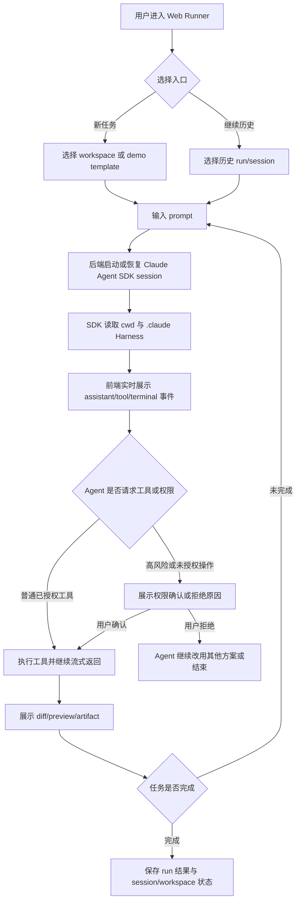
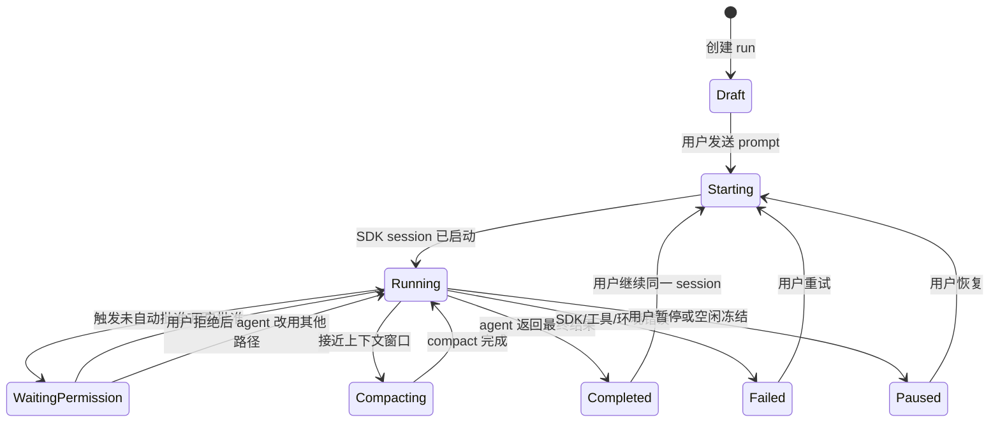
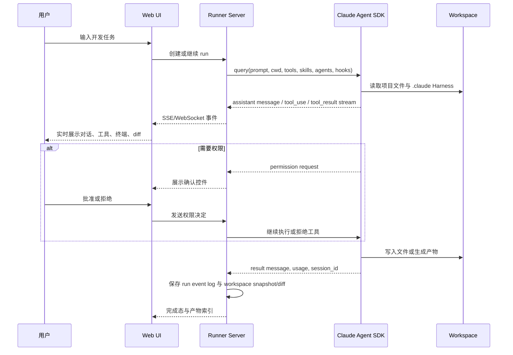

# 产品需求文档：Harness Engineering Product - Web Claude Code Runner V0.1

版本：V0.1
日期：2026-06-06
状态：初稿，待产品确认

## 1. 综述 (Overview)

### 1.1 项目背景与核心问题

当前 `harness-engineering-product` 目录保存的是两套本地 Agent Harness 资产的合并讨论工作区：

1. `product-manager-harness-4.0`：面向 Claude Code 的产品开发 Harness，包含 `CLAUDE.md`、skills、agents、hooks、feedback/evolution 体系。
2. `jingjing-harness`：面向 Codex 的项目协作 Harness，包含 `AGENTS.md`、`.codex`、long-task-gate、handoff/progress 纪律。

这两套资产证明了一个核心能力：通过 skills、hooks、subagents 和协作规则，可以让 AI 从“聊天写代码”升级为“受控工程执行”。但它们目前主要运行在本地 Claude Code 或 Codex 环境里，外部用户无法直观看到运行过程，也无法通过网页体验“一个 Agent 如何真实读文件、改代码、跑命令、审查、修复”。

本 PRD 的目标不是把 PM 4.0 的流程硬编码成一个 Web 状态机，也不是从零实现一个 agent runtime。目标是借助 Claude Agent SDK，把本地 Claude Code 式运行能力搬到网页上：前端提供高保真 Web UI，后端调用 Claude Agent SDK 执行真实 agent loop，`.claude` Harness 资产继续承担规则、skills、subagents、hooks 和流程调度。

核心原则：

1. Web 产品是 Claude Code 式运行体验的 UI 和证据层，不是硬编码流程编排器。
2. 流程由 Claude Agent SDK 加载的 `CLAUDE.md`、skills、agents、hooks 和当前上下文共同决定。
3. 数据层主要记录 event log、run log、diff、artifact、session，而不是强制用户必须按固定流程走。
4. 安全边界必须硬编码：工作目录、工具权限、Bash 限制、密钥隔离、预算限制、公开展示模式。

参考依据：

- Claude Agent SDK / Claude Code SDK 官方文档：https://docs.anthropic.com/en/docs/claude-code/sdk
- Claude Agent SDK TypeScript 仓库：https://github.com/anthropics/claude-agent-sdk-typescript
- Claude Agent SDK Python 仓库：https://github.com/anthropics/claude-agent-sdk-python
- Agent SDK sessions 文档：https://code.claude.com/docs/en/agent-sdk/sessions
- Agent SDK hosting 文档：https://code.claude.com/docs/en/agent-sdk/hosting
- Agent SDK streaming output 文档：https://code.claude.com/docs/en/agent-sdk/streaming-output

### 1.2 核心业务流程 / 用户旅程地图

1. **进入项目与会话** - 用户进入 Web Runner，选择一个项目 workspace 或预设 demo，创建新 Run 或继续历史 Run。
2. **网页对话与实时执行** - 用户像使用 Claude Code 一样输入任务，系统通过 Claude Agent SDK 启动或恢复 agent session，并实时展示 assistant message、tool use、tool result、terminal output。
3. **文件变更与产物查看** - 用户在同一界面查看文件树、diff、命令结果、页面预览、生成文档和 review 报告。
4. **Harness 资产加载与自由调度** - 系统加载 `.claude/CLAUDE.md`、skills、agents、hooks，让 agent 自己判断是否需要写 PRD、制定计划、开发、审查或修复。
5. **会话持久化与恢复** - 系统保存 session id、run events、workspace 状态、diff 和 artifacts，支持长会话、恢复和上下文压缩后的继续工作。
6. **安全与展示模式控制** - 系统区分 owner/internal 模式和 public demo 模式，限制工具、Bash、文件范围、密钥访问、预算和 push/deploy 行为。

### 1.3 Mermaid 图（流程/状态/时序）

#### 1.3.1 用户操作流



#### 1.3.2 Run 状态机



#### 1.3.3 实时执行时序



## 2. 产品定位与范围

### 2.1 产品定位

本产品是一个 Web Claude Code Runner：用户通过网页与一个运行在后端 workspace 中的 Claude Agent SDK session 对话，实时看到 Agent 的消息、工具调用、命令输出、文件修改、diff、预览和最终产物。

它不是传统聊天机器人，也不是第一版就做完整 IDE。它的核心展示价值是：把本地 Claude Code / PM 4.0 Harness 的执行过程可视化，让用户看到 AI 工程执行不是一段回答，而是一条可观察、可追踪、可恢复的运行轨迹。

### 2.2 V0.1 范围

V0.1 做：

1. 一个高保真 Web Claude Code 式对话界面。
2. 一个后端 Claude Agent SDK runner。
3. 对单个或少量 workspace 的 long-running / hybrid session 支持。
4. SDK stream 到 Web UI 的实时渲染。
5. tool timeline、terminal output、diff、preview/artifact 面板。
6. `.claude` Harness 资产加载：`CLAUDE.md`、skills、agents、hooks。
7. owner/internal 模式下的真实执行。
8. public demo 模式下的安全回放或受控 demo run。

V0.1 不做：

1. 不做完整 Cursor/Trae 级 IDE，不优先支持用户手动编辑代码。
2. 不把 PM 4.0 流程写死成后端状态机。
3. 不做任意公网用户无限制执行 Bash。
4. 不做复杂多租户 SaaS 计费、团队权限、组织管理。
5. 不默认允许自动 push/deploy 到真实远端。
6. 不承诺完全复刻 Claude Code 官方 UI 或品牌，不使用会混淆官方产品归属的命名和视觉。

## 3. 用户故事详述 (User Stories)

### 阶段一：进入项目与会话

---

#### US-01: 作为用户，我希望选择一个项目或 demo 并创建/继续 Claude Code 式会话，以便在网页中开始真实 Agent 执行

* **价值陈述 (Value Statement)**:
  * **作为** 产品 owner、开发者或展示访客
  * **我希望** 在网页里选择 workspace、demo template 或历史 run
  * **以便于** 像使用本地 Claude Code 一样发起或继续一个工程任务

* **业务规则与逻辑 (Business Logic)**:
  1. **前置条件**:
     * 系统至少存在一个可用 workspace 或 demo template。
     * owner/internal 模式可以访问真实 workspace。
     * public demo 模式只能访问安全 demo、回放或受控 sandbox。
  2. **操作流程 (Happy Path)**:
     * 用户进入 Web Runner 首页。
     * 系统展示项目列表、最近 runs、demo templates。
     * 用户选择“新建 run”或“继续历史 run”。
     * 系统创建 run 记录，并绑定 workspace、session 策略和权限策略。
     * 用户进入对话页面，可以输入 prompt。
  3. **异常处理 (Error Handling)**:
     * workspace 不存在：展示“该项目不可用”，允许返回选择其他项目。
     * session 无法恢复：展示“可基于当前 workspace 开新会话”，不丢失已保存 diff/artifact。
     * public 用户请求真实 workspace：拒绝访问，转到 demo 模式。

* **验收标准 (Acceptance Criteria)**:
  * **场景1: 新建 owner/internal run**
    * **GIVEN** 用户拥有 owner/internal 权限且存在可用 workspace
    * **WHEN** 用户选择 workspace 并点击新建 run
    * **THEN** 系统创建 run，并进入带输入框的 Web Runner 页面
  * **场景2: 继续历史 run**
    * **GIVEN** 历史 run 已保存 session id 和 workspace 状态
    * **WHEN** 用户选择继续
    * **THEN** 系统恢复该 run 的对话、事件日志和可查看产物
  * **场景3: public 用户访问真实 workspace**
    * **GIVEN** 用户没有 owner/internal 权限
    * **WHEN** 用户尝试进入真实 workspace
    * **THEN** 系统拒绝访问，并提示选择公开 demo

* **页面布局线框图 (ASCII Wireframe)**:

```text
+--------------------------------------------------------------------------------+
| Harness Web Runner                                      User: Owner/Public      |
+--------------------------------------------------------------------------------+
| Projects / Demos                  | Recent Runs                                 |
|-----------------------------------+---------------------------------------------|
| [ ] PM 4.0 Harness Demo           | Run #104  PM4 demo  completed   Continue    |
| [ ] Local Portfolio Workspace     | Run #103  login page running     Open        |
| [ ] Controlled Public Sandbox     | Run #102  replay only completed  Replay      |
|                                   |                                             |
| Mode:                             |                                             |
| (o) Internal real runner          |                                             |
| ( ) Public safe demo              |                                             |
|                                   |                                             |
| [Create New Run]                  |                                             |
+--------------------------------------------------------------------------------+
```

---

### 阶段二：网页对话与实时执行

---

#### US-02: 作为用户，我希望在网页里像 Claude Code 一样输入任务并实时看到 Agent 执行，以便理解任务正在怎样推进

* **价值陈述 (Value Statement)**:
  * **作为** 用户
  * **我希望** 在网页输入自然语言任务，并实时看到 Claude 的回复、工具调用和命令输出
  * **以便于** 获得接近本地 Claude Code 的使用体验

* **业务规则与逻辑 (Business Logic)**:
  1. **前置条件**:
     * run 已创建并绑定 workspace。
     * 后端可以调用 Claude Agent SDK。
     * 权限策略已确定，例如允许 `Read`、`Grep`、`Glob`、受控 `Bash`，以及按模式允许或禁止 `Edit/Write`。
  2. **操作流程 (Happy Path)**:
     * 用户在输入框输入任务。
     * 后端调用 Claude Agent SDK，传入 prompt、cwd、tools/allowed_tools、skills、agents、hooks、session 配置。
     * SDK stream 输出 assistant message、tool use、tool result、result message。
     * 后端将 SDK 消息转换为 Web 事件，通过 SSE 或 WebSocket 发送给前端。
     * 前端分别渲染聊天、工具 timeline、terminal output、文件变更和完成态。
  3. **异常处理 (Error Handling)**:
     * SDK 启动失败：显示 runner 错误和重试按钮。
     * stream 中断：保留已收到事件，提示重新连接。
     * 工具执行超时：展示超时原因，允许用户继续对话或重试。
     * 触发权限拦截：展示工具名、原因、批准/拒绝控件。

* **验收标准 (Acceptance Criteria)**:
  * **场景1: 实时看到 assistant 回复**
    * **GIVEN** run 已进入 ready 状态
    * **WHEN** 用户发送 prompt
    * **THEN** 页面在任务完成前持续追加 Claude 的文本消息
  * **场景2: 实时看到工具调用**
    * **GIVEN** Claude 使用 `Read`、`Bash` 或 `Edit`
    * **WHEN** SDK stream 产生 tool use/tool result
    * **THEN** UI 在工具 timeline 中显示工具名、目标、状态和结果摘要
  * **场景3: stream 中断后恢复展示**
    * **GIVEN** 后端已经保存部分 event log
    * **WHEN** 浏览器连接断开再恢复
    * **THEN** 前端重新加载历史 event log，并继续接收新事件

* **页面布局线框图 (ASCII Wireframe)**:

```text
+--------------------------------------------------------------------------------+
| Harness Runner | Project: PM4 Demo | Run #104 | Status: Running | Cost: $0.42   |
+----------------+---------------------------------------------------------------+
| Sessions       | Conversation                                      | Inspector  |
|----------------|---------------------------------------------------|------------|
| + New Run      | User                                              | Tabs       |
| #104 running   | > 帮我把这个 Harness 做成网页 Claude Code demo      | [Tools]    |
| #103 complete  |                                                   | [Diff]     |
| #102 replay    | Claude                                            | [Files]    |
|                | 我先查看项目结构和 .claude 配置。                  | [Preview]  |
|                |                                                   |------------|
|                | Tool: Read _merge-workspace/README.md             | Tool list  |
|                | Tool: Glob .claude/skills                         | Read  done |
|                |                                                   | Bash  run  |
|                | Claude                                            | Edit  wait |
|                | 我会先保留自由对话模式，不把流程写死。             |            |
|----------------|---------------------------------------------------|------------|
| Input: [ 继续，把 UI 原型也生成出来                         ] [Send] |
+--------------------------------------------------------------------------------+
```

---

### 阶段三：文件变更与产物查看

---

#### US-03: 作为用户，我希望在对话旁边查看文件变更、diff、终端输出和预览，以便判断 Agent 是否真的完成了任务

* **价值陈述 (Value Statement)**:
  * **作为** 用户
  * **我希望** 在同一页面查看 Agent 改了什么、跑了什么、生成了什么
  * **以便于** 不依赖 Claude 的口头总结，而是用证据判断任务进展

* **业务规则与逻辑 (Business Logic)**:
  1. **前置条件**:
     * workspace 可读。
     * 系统能读取 git diff 或文件变更快照。
     * 如果存在前端应用，系统可展示 preview URL 或静态 artifact。
  2. **操作流程 (Happy Path)**:
     * 当 SDK 发生文件写入或编辑事件，系统标记 workspace dirty。
     * Inspector 的 Diff tab 展示新增、修改、删除文件。
     * Terminal tab 展示 Bash 命令、退出状态和关键输出。
     * Preview tab 展示本地 dev server、生成页面、截图或 artifact 链接。
     * Artifact tab 展示 PRD、DEV-PLAN、review report、patch、summary 等文档产物。
  3. **异常处理 (Error Handling)**:
     * 无 git 仓库：改用文件快照 diff。
     * dev server 不可用：展示命令输出和失败原因。
     * 文件过大或二进制：只展示文件名、大小和下载/预览提示。

* **验收标准 (Acceptance Criteria)**:
  * **场景1: 查看代码 diff**
    * **GIVEN** Agent 修改了一个或多个文本文件
    * **WHEN** 用户打开 Diff tab
    * **THEN** UI 展示文件列表和逐文件 diff
  * **场景2: 查看终端输出**
    * **GIVEN** Agent 执行过 Bash 命令
    * **WHEN** 用户打开 Terminal tab
    * **THEN** UI 展示命令、开始/结束时间、退出状态和输出摘要
  * **场景3: 查看产物**
    * **GIVEN** Agent 生成了 PRD、DEV-PLAN、review report 或其他 artifact
    * **WHEN** 用户打开 Artifacts tab
    * **THEN** UI 展示产物列表和可打开详情

* **页面布局线框图 (ASCII Wireframe)**:

```text
+--------------------------------------------------------------------------------+
| Inspector: Diff                                                                 |
+--------------------------------------+-----------------------------------------+
| Changed Files                        | Diff                                    |
|--------------------------------------|-----------------------------------------|
| M Product-Spec.md                    | @@ -12,6 +12,18 @@                     |
| A app/runner/page.tsx                | + Web Runner shell                     |
| M app/api/runs/stream/route.ts       | + SDK stream adapter                   |
|                                      | - old placeholder                      |
|                                      | + real event renderer                  |
|                                      |                                         |
| [Terminal] [Preview] [Artifacts]     |                                         |
+--------------------------------------------------------------------------------+
```

---

### 阶段四：Harness 资产加载与自由调度

---

#### US-04: 作为产品 owner，我希望系统加载 PM 4.0 的 `.claude` Harness，而不是把流程写死在后端，以便保留 Agent 自主调度能力

* **价值陈述 (Value Statement)**:
  * **作为** 产品 owner
  * **我希望** Web Runner 使用 `.claude/CLAUDE.md`、skills、agents、hooks 作为运行规则
  * **以便于** 保留 Claude Code 原生的自由对话和 Agent 自主调度，而不是变成僵硬流程系统

* **业务规则与逻辑 (Business Logic)**:
  1. **前置条件**:
     * workspace 中存在或可注入 `.claude` Harness preset。
     * Harness preset 至少包含 controller 指令、核心 skills、subagents 和 hooks 配置。
  2. **操作流程 (Happy Path)**:
     * 创建 run 时，系统选择一个 Harness preset，例如 PM 4.0。
     * 后端将 preset 放入 workspace 的 `.claude` 目录或通过 SDK 配置加载。
     * Claude Agent SDK 发现并启用 skills、agents、hooks。
     * 用户可以直接要求“修 bug”、“写 PRD”、“直接开发”、“审查代码”，Agent 根据上下文自行判断路径。
     * UI 只展示当前实际发生的动作，不强制阶段顺序。
  3. **异常处理 (Error Handling)**:
     * `.claude` 缺失：使用默认 minimal runner prompt，并提示 Harness 未加载。
     * skill 解析失败：禁用失败 skill，展示错误，其他能力继续可用。
     * hook 误拦截：展示 hook 名称、拦截原因、是否可由 owner 覆盖。

* **验收标准 (Acceptance Criteria)**:
  * **场景1: 直接开发而不先写 PRD**
    * **GIVEN** 用户在已加载 Harness 的 workspace 中输入“别写 PRD，直接修这个 bug”
    * **WHEN** Agent 判断可以直接进入开发或 bug-fixer
    * **THEN** Web 后端不得因为没有 `Product-Spec.md` 而阻止执行
  * **场景2: Agent 自主调用 skill**
    * **GIVEN** workspace 中存在 `skills/dev-builder/SKILL.md`
    * **WHEN** 用户提出开发任务
    * **THEN** Agent 可以依据 skill 描述自行调用或引用该 skill
  * **场景3: Hook 拦截危险命令**
    * **GIVEN** Agent 尝试执行被禁止的 Bash 命令
    * **WHEN** PreToolUse hook 返回拒绝
    * **THEN** UI 显示被拒绝的工具、原因和可恢复操作

* **页面布局线框图 (ASCII Wireframe)**:

```text
+--------------------------------------------------------------------------------+
| Run Settings                                                                    |
+--------------------------------------------------------------------------------+
| Harness Preset                                                                  |
| (o) PM 4.0 Product Manager Harness                                               |
| ( ) Minimal Claude Code Runner                                                   |
| ( ) Jingjing Codex-style Collaboration Rules                                     |
|                                                                                  |
| Loaded Assets                                                                    |
| [ok] CLAUDE.md                                                                   |
| [ok] skills/product-spec-builder                                                 |
| [ok] skills/dev-builder                                                          |
| [ok] skills/code-review                                                          |
| [ok] agents/implementer                                                          |
| [ok] agents/code-reviewer                                                        |
| [ok] hooks/pre-tool-use                                                          |
|                                                                                  |
| Flow Control                                                                     |
| [x] Agent-led flow                                                               |
| [ ] Enforce fixed PRD -> Plan -> Build state machine                             |
+--------------------------------------------------------------------------------+
```

---

### 阶段五：会话持久化与恢复

---

#### US-05: 作为用户，我希望网页会话像本地 Claude Code 一样可以长时间持续或恢复，以便不中断复杂工程任务

* **价值陈述 (Value Statement)**:
  * **作为** 用户
  * **我希望** run 可以继续、恢复、暂停，并保留上下文和文件状态
  * **以便于** 支持长时间、多轮、多阶段的工程任务

* **业务规则与逻辑 (Business Logic)**:
  1. **前置条件**:
     * SDK session id 可保存。
     * workspace 文件状态可保存或保持挂载。
     * event log 可持久化。
  2. **操作流程 (Happy Path)**:
     * 创建 run 时，系统生成 run id，并保存 SDK session id。
     * 每个 SDK message 被转成 event 写入数据库或日志。
     * workspace 使用常驻目录、volume、git worktree 或 snapshot 保存。
     * 用户离开后，run 可以进入 paused。
     * 用户回来后，系统恢复 event log、workspace，并通过 SDK `resume/continue` 或新 prompt 继续。
  3. **异常处理 (Error Handling)**:
     * SDK session 可恢复但 workspace 丢失：提示只能从保存的 diff/artifact 继续，不能保证完整上下文。
     * workspace 可恢复但 SDK session 丢失：提示可基于当前文件状态开启新 session。
     * 发生 context compaction：UI 显示 compact boundary，并保留 compact 后继续工作的提示。

* **验收标准 (Acceptance Criteria)**:
  * **场景1: 继续长会话**
    * **GIVEN** 用户之前有一个 paused run
    * **WHEN** 用户点击继续并发送新 prompt
    * **THEN** 系统恢复历史事件、workspace 状态，并继续同一任务上下文
  * **场景2: 显示上下文压缩**
    * **GIVEN** SDK 触发 context compaction
    * **WHEN** stream 中出现 compact boundary 或相关系统事件
    * **THEN** UI 在 timeline 中标记“上下文已压缩”，但不中断用户继续对话
  * **场景3: workspace 和 session 分离处理**
    * **GIVEN** session 或 workspace 其中之一恢复失败
    * **WHEN** 用户打开该 run
    * **THEN** 系统明确说明缺失的是对话上下文还是文件状态，并提供可继续路径

* **页面布局线框图 (ASCII Wireframe)**:

```text
+--------------------------------------------------------------------------------+
| Run #104 Details                                                                |
+-------------------------------+------------------------------------------------+
| Session                       | Workspace                                      |
|-------------------------------|------------------------------------------------|
| SDK session: ses_abc123       | Path: /workspaces/pm4-demo/run-104             |
| Mode: long-running / hybrid   | Git: dirty, 6 files changed                    |
| State: paused                 | Snapshot: saved 2026-06-06 18:12               |
| Last compact: 18:03           | Preview: http://runner.local/preview/104       |
| Cost: $1.74                   |                                                |
|                               | [Resume Run] [Fork Run] [Export Diff]          |
+--------------------------------------------------------------------------------+
```

---

### 阶段六：安全与展示模式控制

---

#### US-06: 作为系统 owner，我希望限制工具、文件范围、Bash、密钥和预算，以便网页 Agent 不会变成不受控远程执行入口

* **价值陈述 (Value Statement)**:
  * **作为** 系统 owner
  * **我希望** 对 Agent 执行能力设置清晰安全边界
  * **以便于** 同时支持真实运行和公开展示，而不暴露本地环境、密钥或生产项目

* **业务规则与逻辑 (Business Logic)**:
  1. **前置条件**:
     * 每个 run 必须绑定权限策略。
     * 每个 run 必须绑定 cwd，禁止越权访问其他目录。
     * 每个 run 必须记录模型、预算、工具 allowlist/disallowlist。
  2. **操作流程 (Happy Path)**:
     * owner/internal 模式允许更完整工具，但仍限制危险 Bash 和密钥访问。
     * public demo 模式优先使用 replay 或受控 sandbox。
     * 未预批准工具触发权限确认。
     * 高风险命令由 hooks 或 permission callback 拒绝。
     * 达到预算或时间限制后，run 暂停并提示用户。
  3. **异常处理 (Error Handling)**:
     * Agent 尝试读取敏感路径：拒绝并展示原因。
     * Agent 尝试输出疑似密钥：前端和后端日志做脱敏。
     * Agent 尝试 push/deploy：默认要求 owner 显式确认。
     * public 用户尝试绕过限制：结束 run 或切换 replay。

* **验收标准 (Acceptance Criteria)**:
  * **场景1: 限制 cwd**
    * **GIVEN** run 的 workspace 是 `/workspaces/run-104`
    * **WHEN** Agent 尝试读取 workspace 之外的文件
    * **THEN** 系统拒绝并记录安全事件
  * **场景2: Bash 命令拦截**
    * **GIVEN** 权限策略禁止 destructive command
    * **WHEN** Agent 尝试执行危险 Bash
    * **THEN** hook 或 permission 层拒绝，UI 显示拒绝原因
  * **场景3: 预算限制**
    * **GIVEN** run 配置了 max budget
    * **WHEN** 预算达到上限
    * **THEN** 系统暂停继续调用，提示用户确认是否继续

* **页面布局线框图 (ASCII Wireframe)**:

```text
+--------------------------------------------------------------------------------+
| Permission Request                                                              |
+--------------------------------------------------------------------------------+
| Claude wants to run Bash                                                        |
|                                                                                |
| Command: pnpm install && pnpm test                                               |
| Workspace: /workspaces/pm4-demo/run-104                                          |
| Risk: Medium                                                                     |
| Reason: install dependencies and run validation                                  |
|                                                                                |
| Policy                                                                          |
| [ok] inside cwd                                                                  |
| [ok] no secret path                                                              |
| [warn] network/package install                                                   |
|                                                                                |
| [Approve Once] [Always Allow pnpm test] [Deny]                                   |
+--------------------------------------------------------------------------------+
```

---

### 阶段七：公开展示与可控 Demo

---

#### US-07: 作为公开访客，我希望看到 Web Claude Code Runner 的真实执行感和成果，以便理解 Harness Engineering 的价值

* **价值陈述 (Value Statement)**:
  * **作为** 公开访客或潜在合作方
  * **我希望** 在网页上看到 Agent 从输入任务到调用工具、修改文件、生成成果的全过程
  * **以便于** 理解这个项目不是普通作品集页面，而是一个可运行的 AI 工程系统

* **业务规则与逻辑 (Business Logic)**:
  1. **前置条件**:
     * public demo 不得访问真实私有 workspace。
     * public demo 不得暴露真实密钥、私有路径、真实 git remote。
     * V0.1 可优先使用录制回放或固定 sandbox。
  2. **操作流程 (Happy Path)**:
     * 访客进入公开 demo 页面。
     * 系统展示一个可播放的 Run replay 或可输入受控 prompt 的 sandbox。
     * 访客看到对话、tool timeline、diff、preview、review/artifact。
     * 页面明确表现这是 Harness Web Runner 的 demo，而不是 Anthropic 官方 Claude Code。
  3. **异常处理 (Error Handling)**:
     * public demo runner 资源不足：降级到 replay。
     * 用户输入越界任务：提示 demo 仅支持预设范围。
     * replay 数据缺失：展示静态 artifact 和说明。

* **验收标准 (Acceptance Criteria)**:
  * **场景1: 观看 replay**
    * **GIVEN** 系统保存了一个完整 run replay
    * **WHEN** 访客点击播放
    * **THEN** 页面按时间顺序展示用户 prompt、Claude message、tool call、diff 和完成结果
  * **场景2: 受控 demo 输入**
    * **GIVEN** public demo 支持受控 sandbox
    * **WHEN** 访客输入允许范围内的任务
    * **THEN** 系统执行受限 agent run，并隐藏真实内部路径和密钥
  * **场景3: 越界输入**
    * **GIVEN** public demo 不允许任意 Bash 或私有项目访问
    * **WHEN** 访客请求访问真实项目或执行危险操作
    * **THEN** 系统拒绝，并提示选择预设 demo 任务

* **页面布局线框图 (ASCII Wireframe)**:

```text
+--------------------------------------------------------------------------------+
| Harness Engineering Demo                                                        |
+--------------------------------------------------------------------------------+
| Left: Replay Control            | Center: Agent Run                 | Right      |
|---------------------------------+-----------------------------------+------------|
| Demo: PM 4.0 Web Runner         | User: Make this project web-ready | Tools      |
| [Play] [Pause] [Restart]        | Claude: Reading workspace...      | Read done  |
| Speed: 1x                       | Tool: Read CLAUDE.md              | Edit done  |
|                                 | Tool: Edit Product-Spec.md        | Bash done  |
| Timeline                        | Claude: Generated PRD and diff    |            |
| 00:00 prompt                    |                                   | Diff       |
| 00:12 read files                |                                   | +PRD       |
| 00:44 edit files                |                                   | +UI shell  |
| 01:30 tests                     |                                   |            |
+--------------------------------------------------------------------------------+
```

---

## 4. 关键产品规则

### 4.1 Agent-led flow，不做硬状态机

Web 后端不得强制以下流程：

```text
必须先 Product-Spec
必须再 DEV-PLAN
必须再 implementation
必须再 review
```

正确做法：

1. 后端记录发生过什么。
2. UI 可基于 event 和文件产物推断当前 activity label。
3. `.claude` Harness 决定 Agent 应如何响应用户请求。
4. 用户可以直接要求修 bug、直接开发、只写 PRD、只做 review。

### 4.2 数据结构以 event log 为主

核心记录对象建议是：

1. `Run`：一次可恢复的 Agent 执行上下文。
2. `RunEvent`：SDK stream 转换后的事件，包括 assistant message、tool use、tool result、system event、permission request、result。
3. `Workspace`：项目文件状态、路径、snapshot、git diff。
4. `Artifact`：PRD、DEV-PLAN、review report、patch、截图、preview URL。
5. `PermissionDecision`：用户或策略对工具调用的批准/拒绝记录。

这些对象用于展示和恢复，不用于把 PM 4.0 流程锁死。

### 4.3 Session 和 workspace 必须分开理解

Claude Agent SDK session 负责保存对话 transcript、tool call history、context 和 session id。

Workspace 负责保存真实文件状态、依赖、diff、artifact、preview。

因此恢复一个 run 时必须分别检查：

1. session 是否可恢复。
2. workspace 是否可恢复。
3. event log 是否完整。
4. artifact 是否可查看。

### 4.4 运行模式策略

V0.1 推荐采用本地或内测 long-running worker：

1. 一个常驻 runner process。
2. 一个或少量持久 workspace。
3. 支持继续同一 SDK session。
4. 适合 owner 自己使用和制作 demo。

V0.2 后再演进到 hybrid workspace：

1. 空闲后冻结或销毁 runner。
2. 保留 session id、event log、workspace snapshot。
3. 恢复时重建 runtime。

V0.1 不直接做大规模多租户 ephemeral container 平台。

### 4.5 Brand 与公开展示

产品可以提供 Claude Code 式体验，但不能表现成 Anthropic 官方 Claude Code 产品。公开展示中应使用自己的品牌名，例如 Harness Web Runner、Harness Engineering Demo、Agent Workbench 等。

## 5. 技术需求摘要

### 5.1 前端需求

1. 支持 Claude Code 式输入框和流式消息渲染。
2. 支持 tool timeline：工具名、状态、输入摘要、输出摘要、耗时。
3. 支持 terminal output：命令、输出、退出状态。
4. 支持 diff viewer：新增/修改/删除文件。
5. 支持 file/artifact list。
6. 支持 preview iframe 或 artifact preview。
7. 支持 permission request UI。
8. 支持 compact boundary、session pause/resume、error/retry 状态。

### 5.2 后端需求

1. 调用 Claude Agent SDK，并处理 async stream。
2. 将 SDK message 转换为统一 Web event。
3. 通过 SSE 或 WebSocket 推送实时事件。
4. 管理 run、session id、workspace、artifact。
5. 管理 `.claude` Harness preset 注入或加载。
6. 管理权限策略、tool allowlist/disallowlist、hooks。
7. 管理预算、超时、并发和取消。

### 5.3 Workspace 需求

1. 每个 run 必须有明确 cwd。
2. workspace 不得访问用户无关目录。
3. 需要支持 git diff 或 snapshot diff。
4. 需要支持 preview server 或 artifact preview。
5. 需要保存或导出最终 patch。

### 5.4 安全需求

1. 禁止公开用户访问真实私有 workspace。
2. 禁止默认读取敏感路径和环境变量。
3. 禁止默认自动 push/deploy。
4. Bash 必须经过策略或 hook 检查。
5. 输出日志要做敏感信息脱敏。
6. 每个 run 必须有 max turns、max budget 或时间上限。

## 6. 验收总标准

V0.1 可验收的最低闭环：

1. 用户能在网页新建一个 owner/internal run。
2. 用户能输入 prompt，后端通过 Claude Agent SDK 启动真实 session。
3. 前端能实时展示 assistant 文本和至少两类 tool event。
4. Agent 能在受控 workspace 中读取和修改文件。
5. UI 能展示至少一个文件 diff。
6. UI 能展示至少一个 Bash 命令输出。
7. run 完成后能保存 event log、session id、diff/artifact。
8. 用户能回到历史 run 查看记录。
9. 危险 Bash 或越权路径访问能被拒绝。
10. public demo 不暴露真实 workspace，至少支持 replay 或固定 sandbox。

## 7. 开放问题与待确认事项

1. 第一版技术栈是否直接放进当前个人网站 monorepo，还是为 `harness-engineering-product` 单独建 app。
2. Claude Agent SDK 第一版用 TypeScript 还是 Python。若前端是 Next.js，TypeScript SDK 组合更直接；若希望 runner 独立进程化，Python 也可行。
3. V0.1 是否只做 owner/internal 真实执行，public 只做 replay。
4. Workspace 存储第一版采用本地目录、git worktree，还是容器 volume。
5. Preview 第一版是否需要真实 dev server，还是先展示 diff/artifact。
6. 是否保留 PM 4.0 的全部 hooks，还是先只启用安全 hooks 和最小 feedback hooks。
7. 公开展示的产品命名与品牌视觉需要单独确认，避免和官方 Claude Code 混淆。

## 8. 后续开发建议

建议下一步生成 `DEV-PLAN.md`，按以下阶段拆分：

1. Phase 1：SDK spike，验证本地 runner 能启动 Claude Agent SDK、加载 `.claude`、流式输出事件。
2. Phase 2：Web stream UI，完成聊天、tool timeline、terminal、result message。
3. Phase 3：Workspace diff/artifact，完成文件变更查看和 artifact 索引。
4. Phase 4：Session persistence，完成 run/event/session/workspace 记录与恢复。
5. Phase 5：Safety layer，完成 cwd 限制、Bash hook、权限确认、public demo 降级。
6. Phase 6：高保真 UI 和作品集入口，把它作为个人网站中的真实 Agent 项目展示。
